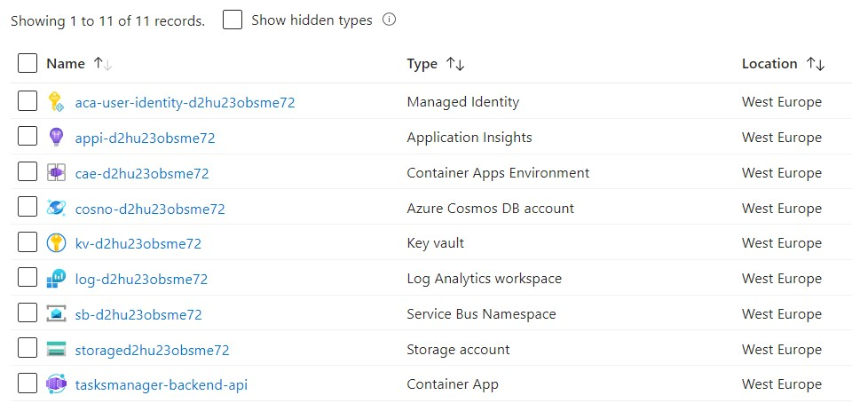
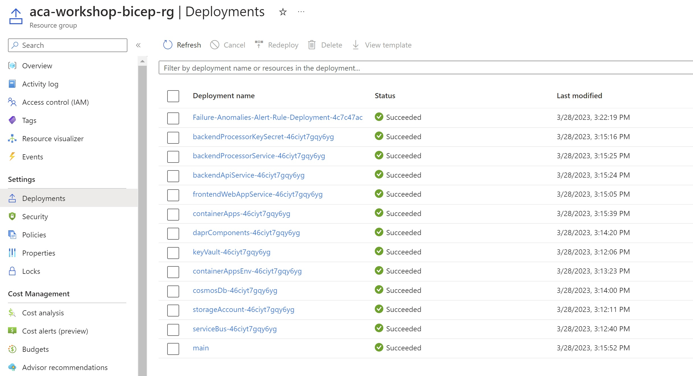

# Build the Infrastructure as Code Using Bicep

!!! info "Module Duration"
    30 minutes

!!! note
    If you're not interested in manually deploying the Bicep files or creating the container registry yourself, and prefer not to delve into the details of how they work, then you can skip this section and head directly to either [Build the Infrastructure as Code Using Bicep and Github](../../aca/06-aca-iac-bicep/ci-cd-git-action.md) or [Build the Infrastructure as Code Using Bicep and Azure DevOps](../../aca/06-aca-iac-bicep/ci-cd-azdo.md) depending on your DevOps tool of choice.

To begin, we need to define the Bicep modules that will be required to generate the Infrastructure code. Our goal for this module is to have a freshly created resource group that encompasses all the necessary resources and configurations - such as connection strings, secrets, environment variables, and Dapr components - which we utilized to construct our solution. By the end, we will have a new resource group that includes the following resources.



!!! note
    To simplify the execution of the module, we will assume that you have already created latest images of three services and pushed them to a container registry. [This section](#deploy-the-infrastructure-and-create-the-components) below guides you through
    different options of getting images pushed to either Azure Container Registry (ACR) or GitHub Container Registry (GHCR).

#### 1. Add the Needed Extension to VS Code
To proceed, you must install an extension called [Bicep](https://marketplace.visualstudio.com/items?itemName=ms-azuretools.vscode-bicep). This extension will simplify building Bicep files as it offers IntelliSense, Validation, listing all available resource types, etc..

### 2. Deploy the Infrastructure and Create the Components

Ensure you are still connected to the Azure subscription you created in the previous module. If not, run the following command to connect to the subscription:

```shell
az login --use-device-code

# Set the default subscription only needed if you have multiple subscriptions
az account set --subscription <your subscription id>
```

Start by creating a new resource group which will contain all the resources to be created by the Bicep scripts.

```Powershell
$RESOURCE_GROUP="<your RG name>"
$LOCATION="<your location>"

az group create `
--name $RESOURCE_GROUP `
--location $LOCATION
```

Create a parameters file which will simplify the invocation of the main bicep file. To achieve this, right click on file `main.bicep` and select **Generate Parameter File**. 
This will result in creating a file named `main.parameters.json` similar to the file below:

??? example

    === "main.parameters.json"
    
        ```json
        --8<-- "https://raw.githubusercontent.com/Azure/aca-dotnet-workshop/main/bicep/main.parameters.json"
        ```
!!! note

    To use this file, you need to edit this generated file and provide values for the parameters. You can use the same values shown above in sample file. 

    You only need to replace parameter values between the angle brackets `<>` with values related to your container registry and SendGrid. Values for container registry and container images can be derived by following
    one of the three options in next step.

Next, we will prepare container images for the three container apps and update the values in `main.parameters.json` file. You can do so by any of the three options below:

=== "Option 1: Build and Push the Images to Azure Container Registry (ACR)"

    1. Create an Azure Container Registry (ACR) inside the newly created Resource Group:

        ```Powershell
        $CONTAINER_REGISTRY_NAME="<your ACR name>"

        az acr create `
            --resource-group $RESOURCE_GROUP `
            --name $CONTAINER_REGISTRY_NAME `
            --sku Basic
        ```

    2. Build and push the images to ACR. Make sure you are at the root project directory when executing the following commands:

        ```Powershell

        ## Build Backend API on ACR and Push to ACR

        az acr build --registry $CONTAINER_REGISTRY_NAME `
            --image "tasksmanager/tasksmanager-backend-api" `
            --file 'TasksTracker.TasksManager.Backend.Api/Dockerfile' .
        
        ## Build Backend Service on ACR and Push to ACR

        az acr build --registry $CONTAINER_REGISTRY_NAME `
            --image "tasksmanager/tasksmanager-backend-processor" `
            --file 'TasksTracker.Processor.Backend.Svc/Dockerfile' .

        ## Build Frontend Web App on ACR and Push to ACR

        az acr build --registry $CONTAINER_REGISTRY_NAME `
            --image "tasksmanager/tasksmanager-frontend-webapp" `
            --file 'TasksTracker.WebPortal.Frontend.Ui/Dockerfile' .
        ```

    3. Update the `main.parameters.json` file with the container registry name and the container images names as shown below:

        ```json hl_lines="3 6 9 12"
        {
            "containerRegistryName": {
                "value": "<CONTAINER_REGISTRY_NAME>"
            },
            "backendProcessorServiceImage": {
                "value": "<CONTAINER_REGISTRY_NAME>.azurecr.io/tasksmanager/tasksmanager-backend-processor:latest"
            },
            "backendApiServiceImage": {
                "value": "<CONTAINER_REGISTRY_NAME>.azurecr.io/tasksmanager/tasksmanager-backend-api:latest"
            },
            "frontendWebAppServiceImage": {
                "value": "<CONTAINER_REGISTRY_NAME>.azurecr.io/tasksmanager/tasksmanager-frontend-webapp:latest"
            }
        }
        ```


=== "Option 2: Import pre-built public images to your private Azure Container Registry"
        
    All the container image are available in a public image repository. If you do not wish to build the container images from code directly, you can import it directly into 
    your private container instance as shown below.

    1. Create an Azure Container Registry (ACR) inside the newly created Resource Group:

        ```Powershell
        $CONTAINER_REGISTRY_NAME="<your ACR name>"

        az acr create `
            --resource-group $RESOURCE_GROUP `
            --name $CONTAINER_REGISTRY_NAME `
            --sku Basic
        ```
    2. Import the images to your private ACR as shown below:

        ```Powershell 

            az acr import `
            --name $CONTAINER_REGISTRY_NAME `
            --image tasksmanager/tasksmanager-backend-api `
            --source ghcr.io/azure/tasksmanager-backend-api:latest
            
            az acr import  `
            --name $CONTAINER_REGISTRY_NAME `
            --image tasksmanager/tasksmanager-frontend-webapp `
            --source ghcr.io/azure/tasksmanager-frontend-webapp:latest
            
            az acr import  `
            --name $CONTAINER_REGISTRY_NAME `
            --image tasksmanager/tasksmanager-backend-processor `
            --source ghcr.io/azure/tasksmanager-backend-processor:latest

        ```

    3. Update the `main.parameters.json` file with the container registry name and the container images names as shown below:

        ```json hl_lines="3 6 9 12"
        {
            "containerRegistryName": {
                "value": "<CONTAINER_REGISTRY_NAME>"
            },
            "backendProcessorServiceImage": {
                "value": "<CONTAINER_REGISTRY_NAME>.azurecr.io/tasksmanager/tasksmanager-backend-processor:latest"
            },
            "backendApiServiceImage": {
                "value": "<CONTAINER_REGISTRY_NAME>.azurecr.io/tasksmanager/tasksmanager-backend-api:latest"
            },
            "frontendWebAppServiceImage": {
                "value": "<CONTAINER_REGISTRY_NAME>.azurecr.io/tasksmanager/tasksmanager-frontend-webapp:latest"
            }
        }
        ```

=== "Option 3: Use the pre-built images from the public repository"

    All the container image are available in a public image repository. If you do not wish to build the container images from code directly, you can use the pre-built images from the public repository as shown below.

    The public images can be set directly in the `main.parameters.json` file:

    ```json hl_lines="3 6 9 12"
    {
        "containerRegistryName": {
            "value": ""
        },
        "backendProcessorServiceImage": {
          "value": "ghcr.io/azure/tasksmanager-backend-processor:latest"
        },
        "backendApiServiceImage": {
          "value": "ghcr.io/azure/tasksmanager-backend-api:latest"
        },
        "frontendWebAppServiceImage": {
          "value": "ghcr.io/azure/tasksmanager-frontend-webapp:latest"
        },
    }   
    ```

Start the deployment by calling `az deployment group create`. To accomplish this, open the PowerShell console and use the content below.


```Powershell
az deployment group create `
--resource-group $RESOURCE_GROUP `
--template-file "./bicep/main.bicep" `
--parameters "./bicep/main.parameters.json"
```

The Azure CLI will take the Bicep module and start creating the deployment in the resource group.

### Verify the Final Results
!!! success
    Upon successful deployment, you should observe all resources generated within the designated resource group. Additionally, you may navigate to the `Deployments` section to confirm that the ARM templates have been deployed, which should resemble the image provided below:

    